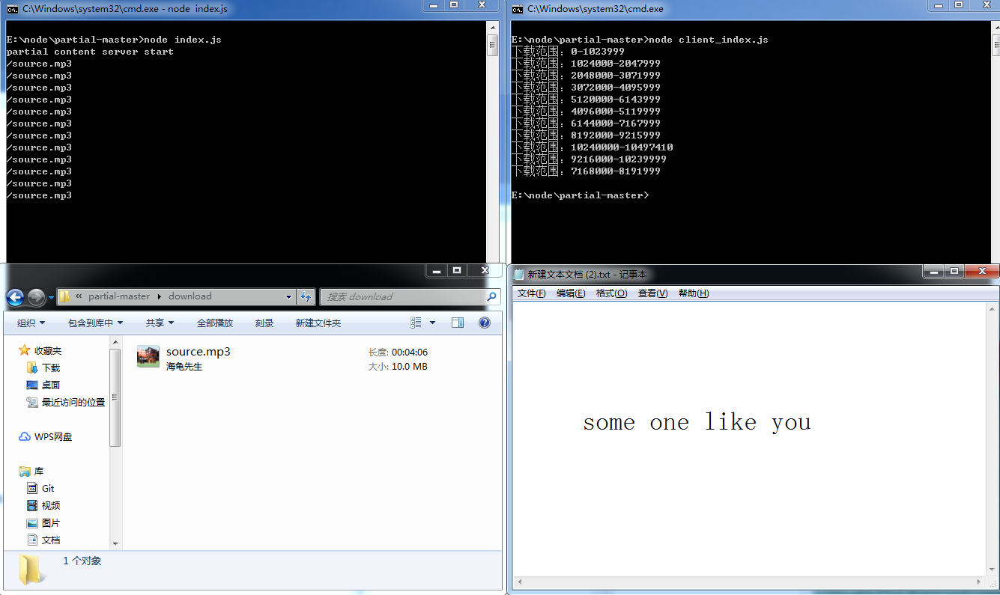

# 一、分片传输测试
## `npm run start`开启服务端
## 打开浏览器控制台可以查看相应206请求片段

# 二、分片下载测试
## 保持服务端开启
## `npm run download`下载测试
## 在控制台可以查看相应分片下载请求
## 或者使用迅雷等第三方软件
### 去开启下载链接 http://localhost:3001/source.mp3 or http://localhost:3001/test.mp4

